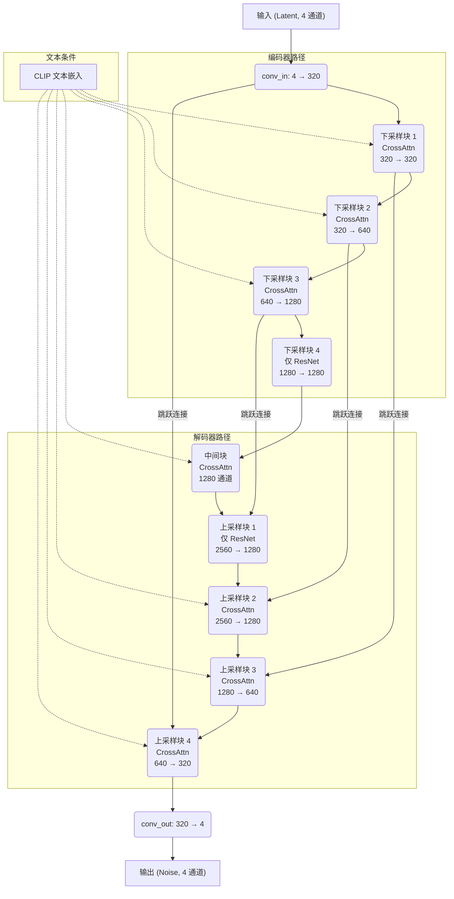

# Stable Diffusion 1.5 - UNet 模型结构

本文档根据其配置文件, 详细概述了 Stable Diffusion 1.5 模型中 UNet 组件的架构。

**注意**: 根据各自的 `config.json` 文件, SD 1.5 UNet 的核心层级架构（块类型、通道数、每块层数）在功能上与 SD 1.4 UNet 相同。主要区别在于训练数据集和可能的权重微调, 而非结构蓝图本身。

## 关键配置参数

- **`_class_name`**: `UNet2DConditionModel`
- **`in_channels`**: 4 (来自 VAE 的输入, 代表一个潜在图像)
- **`out_channels`**: 4 (输出, 预测潜在空间中的噪声)
- **`layers_per_block`**: 2
- **`block_out_channels`**: `[320, 640, 1280, 1280]`
- **`down_block_types`**: `["CrossAttnDownBlock2D", "CrossAttnDownBlock2D", "CrossAttnDownBlock2D", "DownBlock2D"]`
- **`up_block_types`**: `["UpBlock2D", "CrossAttnUpBlock2D", "CrossAttnUpBlock2D", "CrossAttnUpBlock2D"]`
- **`cross_attention_dim`**: 768 (来自 CLIP 的文本条件的维度)
- **`attention_head_dim`**: 8

---

## 架构分解

UNet 处理一个潜在张量 `(B, 4, H/8, W/8)` 和一个文本条件张量 `(B, L, 768)`。

### 1. 输入层 (`conv_in`)

- **类型**: `nn.Conv2d`
- **输入通道数**: 4
- **输出通道数**: 320
- **卷积核大小**: 3x3, 填充: 1
- **描述**: 初始卷积层, 将 4 通道的潜在图像映射到 320 通道的初始块维度。

### 2. 下采样路径 (编码器)

编码器由 4 个下采样块组成。每个块包含 2 个类 ResNet 的子块, 以及在指定位置的交叉注意力层。

#### 下采样块 1

- **类型**: `CrossAttnDownBlock2D`
- **输入通道数**: 320
- **输出通道数**: 320
- **子层数**: 2 (ResNet + CrossAttention)
- **下采样器**: `nn.Conv2d` (通道: 320 -> 320, 卷积核: 3x3, 步长: 2, 填充: 1)
- **描述**: 处理输入, 应用自注意力和与文本提示的交叉注意力, 然后将空间分辨率下采样 2 倍。

#### 下采样块 2

- **类型**: `CrossAttnDownBlock2D`
- **输入通道数**: 320
- **输出通道数**: 640
- **子层数**: 2 (ResNet + CrossAttention)
- **下采样器**: `nn.Conv2d` (通道: 640 -> 640, 卷积核: 3x3, 步长: 2, 填充: 1)
- **描述**: 接收前一个块的输出, 通过 ResNet 和注意力层进一步处理, 然后再次下采样。

#### 下采样块 3

- **类型**: `CrossAttnDownBlock2D`
- **输入通道数**: 640
- **输出通道数**: 1280
- **子层数**: 2 (ResNet + CrossAttention)
- **下采样器**: `nn.Conv2d` (通道: 1280 -> 1280, 卷积核: 3x3, 步长: 2, 填充: 1)
- **描述**: 继续特征提取和下采样过程。

#### 下采样块 4

- **类型**: `DownBlock2D`
- **输入通道数**: 1280
- **输出通道数**: 1280
- **子层数**: 2 (仅 ResNet)
- **下采样器**: 无 (这是中间块之前的最后一个下采样块)
- **描述**: 最后的下采样块。请注意, 此块类型**不**使用交叉注意力。

### 3. 中间块 (`mid_block`)

- **类型**: `UNetMidBlock2DCrossAttn`
- **输入通道数**: 1280
- **描述**: 这是 UNet 的瓶颈。它由以下部分组成：
    1.  一个 `ResnetBlock2D`。
    2.  一个 `Transformer2DModel` (用于自注意力和交叉注意力)。
    3.  第二个 `ResnetBlock2D`。

### 4. 上采样路径 (解码器)

解码器镜像编码器, 使用来自相应下采样块的跳跃连接。它由 4 个上采样块组成。

#### 上采样块 1

- **类型**: `UpBlock2D`
- **输入通道数**: 1280 (来自中间块) + 1280 (跳跃连接) = 2560
- **输出通道数**: 1280
- **子层数**: 3 (仅 ResNet)
- **上采样器**: `nn.Upsample` (缩放因子: 2, 模式: 'nearest') 后跟 `nn.Conv2d`。
- **描述**: 第一个上采样阶段。请注意, 此块**不**使用交叉注意力。

#### 上采样块 2

- **类型**: `CrossAttnUpBlock2D`
- **输入通道数**: 1280 (来自前一个块) + 1280 (跳跃连接) = 2560
- **输出通道数**: 1280
- **子层数**: 3 (ResNet + CrossAttention)
- **上采样器**: `nn.Upsample` 后跟 `nn.Conv2d`。
- **描述**: 第二个上采样阶段。它重新引入了交叉注意力。

#### 上采样块 3

- **类型**: `CrossAttnUpBlock2D`
- **输入通道数**: 640 (来自前一个块) + 640 (跳跃连接) = 1280
- **输出通道数**: 640
- **子层数**: 3 (ResNet + CrossAttention)
- **上采样器**: `nn.Upsample` 后跟 `nn.Conv2d`。
- **描述**: 第三个上采样阶段。

#### 上采样块 4

- **类型**: `CrossAttnUpBlock2D`
- **输入通道数**: 320 (来自前一个块) + 320 (跳跃连接) = 640
- **输出通道数**: 320
- **子层数**: 3 (ResNet + CrossAttention)
- **上采样器**: `nn.Upsample` 后跟 `nn.Conv2d`。
- **描述**: 最后的上采样阶段。

### 5. 输出层 (`conv_out`)

- **类型**: `nn.Conv2d`
- **输入通道数**: 320
- **输出通道数**: 4
- **卷积核大小**: 3x3, 填充: 1
- **描述**: 最终的卷积层, 将 320 通道的特征图映射回 4 通道的潜在空间, 代表预测的噪声。

---

## UNet 结构图 (Mermaid)

